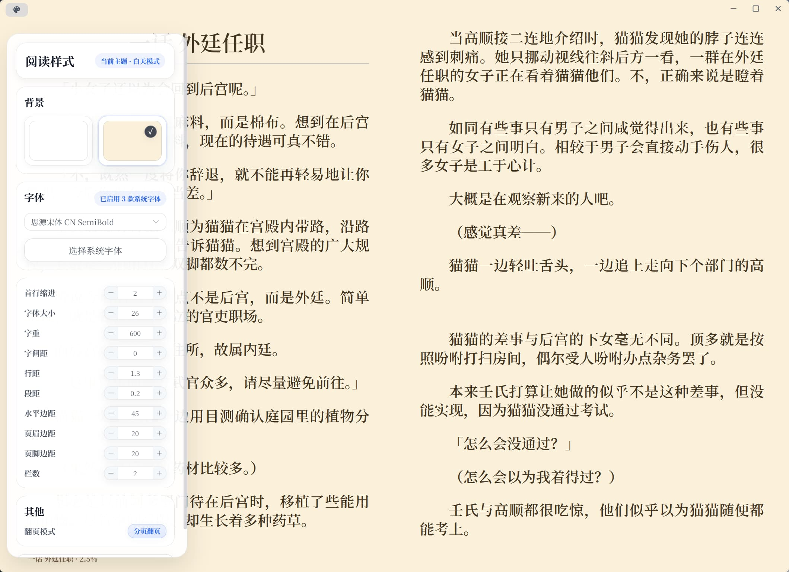

# T-Reader

T-Reader 是一个面向 Windows 桌面端的轻量阅读器项目。项目以轻小说阅读体验为核心，提供书架管理、独立阅读窗口、书签与笔记、WebDAV 云同步、AI 阅读助手与应用内更新能力。


## 核心能力

- 支持 `EPUB` / `TXT` 导入、书架展示与打开阅读
- 书架支持列表 / 网格双视图，并展示封面、格式、最近阅读与进度
- 独立阅读器窗口支持目录、翻页、滚动、快捷键与沉浸式阅读
- 支持 EPUB 书签、高亮和个人笔记，笔记页可统一浏览与跳转
- 阅读样式支持字体、字号、字重、行距、段距、页边距、栏数、翻页模式调节
- 支持 WebDAV 云同步
- 支持应用内检查更新、下载更新

## 界面预览

### 书架网格视图


### 书架列表视图


### 书籍导入


### 阅读器与样式设置



## 技术栈

- 前端：`Vue 3` + `TypeScript` + `Vite 5`
- 桌面容器：`Tauri 2`
- 后端：`Rust`
- 状态管理：`Pinia`
- UI：`Element Plus`
- 阅读引擎：二次开发的 [`libs/epub.js`](https://github.com/NameHitherto/epub.js)

## 项目结构

```text
T-Reader/
├─ src/                  # Vue 前端
│  ├─ views/             # App 主窗口路由视图组件
│  ├─ components/        # 可复用组件、阅读器组件与弹窗
│  ├─ types/             # 共享类型定义
│  ├─ utils/             # 通用工具
│  ├─ services/          # book / reader / fileSystem / notification
│  ├─ store/             # Pinia 状态
│  └─ router/            # 主窗口路由
├─ src-tauri/            # Rust 后端与 Tauri 配置
├─ docs/                 # 项目概览与规范文档
├─ libs/epub.js/         # epub.js 子模块
└─ scripts/              # 版本与发布脚本
```

## 本地与云端数据目录

本地根目录位于 `Document/T-Reader/`：

```text
T-Reader/
├─ books/         # 原始书籍文件（epub / txt）
├─ bookProgress/  # 书籍进度配置
├─ cached/        # 封面、locations、段落统计缓存，以及生产日志 t-reader.log
└─ system/        # setting.json / ReaderConfig.json / BookMarks.json
```

云端 WebDAV 目录：

```text
T-Reader/
├─ books/
└─ bookProgress/
```

说明：

- 开发态日志仅打印到 `npm run tauri dev` 的终端，不写入 DevTools 或本地日志文件
- 打包后的日志写入 `Document/T-Reader/cached/t-reader.log`
- `cached/` 与 `system/BookMarks.json` 当前不参与 WebDAV 同步
- 云端与本地进度冲突时，优先使用 `durChapterTime` 更新较新的配置

## 开发环境

- `Rust 1.89.0`
- 主项目 `Node.js v22.17.1`
- `libs/epub.js` 建议使用 `Node.js v16.20.2`

开始前请先确认本机已满足 Tauri 官方前置环境要求：

- https://tauri.app/start/prerequisites/

## 本地开发

1. 克隆仓库并初始化子模块：

```bash
git clone <repo-url>
cd T-Reader
git submodule update --init --recursive
```

2. 安装 `libs/epub.js` 依赖：

```bash
cd libs/epub.js
npm install
cd ../..
```

3. 安装主项目依赖：

```bash
npm install
```

4. 启动桌面开发环境：

```bash
npm run tauri dev
```

## 常用命令

```bash
npm run dev
npm run build
npm run preview
npm run tauri dev
npm run tauri build
npm run release -- v1.0.1
```

`npm run release` 只会更新并推送 `release` 分支，不再操作 `develop` 分支。

## 相关仓库

- 桌面端仓库：https://github.com/NameHitherto/T-Reader
- ~~移动端仓库：https://github.com/NameHitherto/T-Reader-Mobile~~
