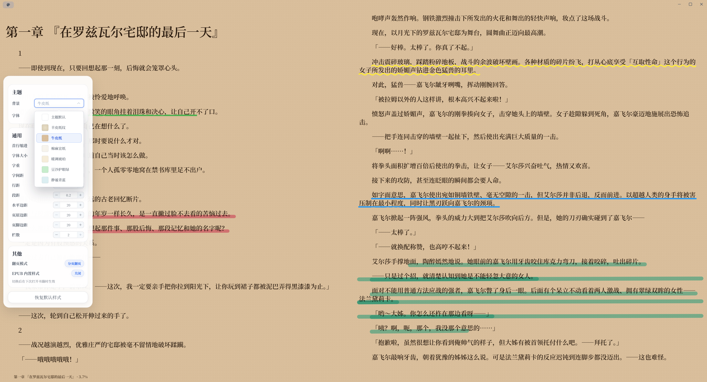

# T-Reader

T-Reader 是一个面向 Windows 桌面端的轻量阅读器项目。项目以轻小说阅读体验为核心，提供书架管理、独立阅读窗口、书签与笔记、WebDAV 云同步、自动更新能力。


## 核心能力

- 支持 `EPUB` / `TXT` 导入、书架展示与打开阅读
- 书架支持列表 / 网格双视图，并支持按标题、作者、阅读时间、添加日期排序，展示封面、格式、最近阅读与进度
- 独立阅读器窗口支持目录、翻页、滚动、快捷键与沉浸式阅读
- 支持 EPUB 书签、通过艺术下划线标注个人笔记，笔记统一管理浏览与跳转
- 阅读界面清爽简洁，书籍字体可选择Windows系统内置字体
- 阅读样式支持字号、字重、行距、段距、页边距、栏数、翻页模式调节
- 支持 WebDAV 云同步，可自定义服务器地址与请求超时，已适配第三方开源移动端阅读器Legado
- 支持应用内检查更新、下载更新，可选择正式版 / 抢先版更新渠道
- 内置 AI 大模型配置（对话、生图、嵌入、重排序模型）
- 画廊：结合书籍的图片和原文内容，使用生图模型进行二次创作
- 书籍、笔记、设置等本地数据基于 SQLite 持久化存储

## UI界面预览

### 书架


### 书架（列表模式）


### 阅读器、样式菜单以及笔记注释



### 云同步


### 画廊


## 技术栈

- 前端：`Vue 3` + `TypeScript` + `Vite 6`
- 桌面容器：`Tauri 2`
- 后端：`Rust`
- 本地存储：`SQLite`（sqlx）
- 状态管理：`Pinia`
- UI：`Element Plus`
- 阅读引擎：二次开发的 [`libs/epub.js`](https://github.com/NameHitherto/epub.js)

## 项目结构

```text
T-Reader/
├─ src/                  # Vue 前端
│  ├─ views/             # App 主窗口路由视图组件
│  ├─ components/        # 可复用组件、阅读器组件与弹窗
│  ├─ composables/       # 组合式函数
│  ├─ constants/         # 常量定义
│  ├─ icons/             # 图标资源
│  ├─ styles/            # 全局样式与主题
│  ├─ types/             # 共享类型定义
│  ├─ utils/             # 通用工具
│  ├─ services/          # book / reader / fileSystem / gallery / settings / sync / notification 等
│  ├─ store/             # Pinia 状态
│  └─ router/            # 主窗口路由
├─ src-tauri/            # Rust 后端与 Tauri 配置
│  ├─ migrations/        # SQLite 数据库迁移
│  └─ capabilities/      # Tauri 权限能力声明
├─ docs/                 # 图片资源与规划文档
├─ libs/epub.js/         # epub.js 子模块
└─ scripts/              # 版本与发布脚本
```

## 本地与云端数据目录

本地根目录位于 `Document/T-Reader/`：

```text
T-Reader/
├─ books/         # 原始书籍文件（epub / txt）
├─ bookProgress/  # 书籍进度配置
├─ cached/        # 封面、locations、段落统计缓存，以及打包后日志 logs/
└─ system/        # SQLite 数据库 t-reader.db（书籍、笔记、设置、阅读样式等）
```

云端 WebDAV 目录：

```text
T-Reader/
├─ books/
└─ bookProgress/
```

## 贡献指南

参与开发前请阅读 [CONTRIBUTING.md](./CONTRIBUTING.md)，了解分支管理、提交规范、issue 处理与发版流程。

## 相关仓库

- 桌面端仓库：https://github.com/NameHitherto/T-Reader
- ~~移动端仓库：https://github.com/NameHitherto/T-Reader-Mobile~~
